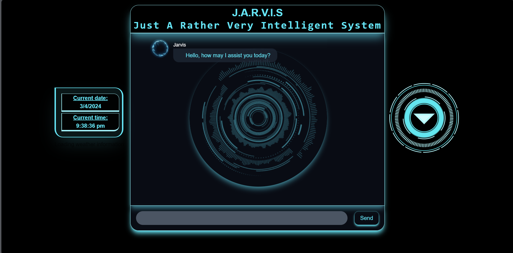

# J.A.R.V.I.S. - Compliance-focused Cybersecurity and Environment Integration




J.A.R.V.I.S. is an AI assistant based on the powerful GPT-4.0 architecture, designed to prioritize compliance for cybersecurity-related inquiries while also providing real-time information about the user's current environment. This project aims to offer a comprehensive solution for users to interact seamlessly with the AI assistant, benefiting from both text-based interactions and voice-based responses through an integrated voice streaming API.

## Table of Contents

- [J.A.R.V.I.S. - Compliance-focused Cybersecurity and Environment Integration](#jarvis---compliance-focused-cybersecurity-and-environment-integration)
  - [Table of Contents](#table-of-contents)
  - [Introduction](#introduction)
  - [Features](#features)
  - [Installation](#installation)
  - [Usage](#usage)
  - [Data Sources](#data-sources)
  - [Model Updates](#model-updates)
  - [Testing](#testing)
  - [Deployment](#deployment)
  - [Contributing](#contributing)
  - [License](#license)

## Introduction

The J.A.R.V.I.S. project is aimed at developing an advanced AI assistant capable of addressing compliance concerns in the field of cybersecurity. It provides real-time information on the user's current environment, weather updates, local news, and emergency alerts. Leveraging the cutting-edge GPT-4.0 architecture, J.A.R.V.I.S. ensures accurate and up-to-date responses to users' inquiries, making it a reliable companion for individuals and organizations seeking cybersecurity insights. Voice Streaming made possible by 11ElevenLabs.io! <3 check them out if you get the chance, and if you need help getting your voiceid and voice model for your personal projects, hmu and I'm more than happy to help!

## Features

- Compliance-focused AI assistant
- Real-time environment information
- Voice streaming for audio interactions
- Voice recognition for disability related recording interactions
- Integration with weather, news, and emergency APIs
- Continuous updates to maintain cybersecurity compliance
- Multi-platform support

## Installation

To install and set up J.A.R.V.I.S., follow these steps:

1. Clone the repository from GitHub:
   ```
   git clone https://github.com/PrakasRavichandran/J.A.R.V.I.S.git
   ```
2. Install the required dependencies:
   ```
   cd J.A.R.V.I.S
   cd Frontend
   npm i --force
   ```
3. Obtain API keys for weather, news, and emergency services and add them to the configuration file.

## Usage

To start interacting with J.A.R.V.I.S., execute the following command in your terminal:

```
npm run dev
```

You can now communicate with J.A.R.V.I.S. through text input or voice commands. For text input, simply type your inquiries and wait for the AI's responses. For voice interactions, ensure your microphone is set up correctly, and speak your questions aloud.

## Data Sources

J.A.R.V.I.S. leverages various data sources and APIs to provide accurate and up-to-date information. The following sources are used:

- Weather Data: [Weather API](https://www.weatherapi.com)
- Local News: [News API](https://www.newsapi.org)
- Emergency Updates: [EmergencyAPI](https://www.emergencyapi.com)

## Model Updates

The AI model is continuously updated to stay current with the latest cybersecurity practices, industry standards, and regulations. This ensures that J.A.R.V.I.S. can deliver accurate and relevant compliance-focused information to users.

## Testing

The project has undergone rigorous testing to ensure seamless integration into various systems and applications across different platforms. Unit tests and integration tests were conducted to validate the functionality and stability of J.A.R.V.I.S.

To run the tests, execute the following command:

```
python run_tests.py
```

## Deployment

J.A.R.V.I.S. is deployed on the Vercel platform, leveraging its robust infrastructure to ensure constant availability and scalability. The deployment process is automated through Vercel's CI/CD pipelines, enabling smooth updates and rapid development cycles.

## Contributing

We welcome contributions to J.A.R.V.I.S.! If you wish to contribute, please follow our [contribution guidelines](CONTRIBUTING.md) to get started.

## License

J.A.R.V.I.S. is released under the [MIT License](LICENSE), granting users the freedom to use, modify, and distribute the software. Make sure to review the license terms before using or contributing to the project.

---
For any questions or inquiries, feel free to reach out to the project owner at lee.pham@example.com. We appreciate your interest in J.A.R.V.I.S.!
